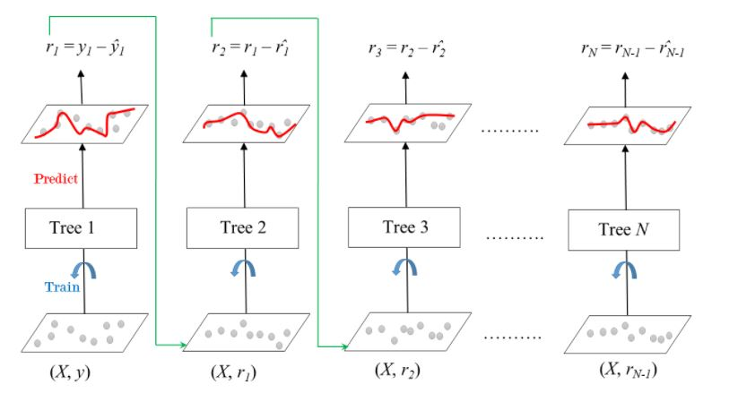
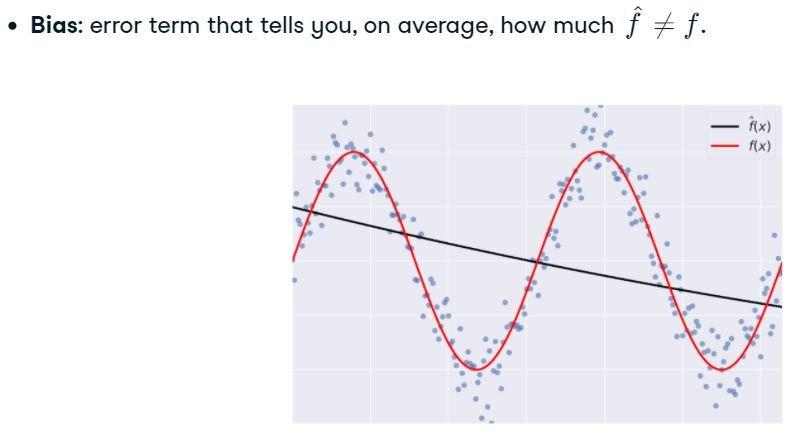

# __Machine Learning with Tree-Based models in Python__
<br>

### Terms:_
- **CART**: Categorication and Regression Tree
- **Decision Tree**: data structure consisting of hierarchy of nodes
- **Nodes**: question or prediction.
- **Root**: no parent nodes, question giving rise to two children nodes
- **Leaf**: no children nodes --> *prediction*

### Advantages:
- Simple to understand, interpret, and use
- *Flexibility*: ability to describe non-linear dependencies 
- *Preprocessing*: no need to standardize or normalize features

### Limitaions:
- *Classification*: can ONLY produce orthogonal decision boundaries
- Sensitive to small variations in the training set. 


<br>
___
<br>

## __Ensemble Learning__
- Train *different* models on the *same* dataset. Letting each model make predictions and then aggregating the predictions into one **Meta-model**


### __Bootstrap aggregation (Bagging)__
- Train *same* argorithm on *different* subsets of the training set.
    - Base estimator: Decision Tree, Logistic Regression, Neural Net, ...

<!--  -->

- **Out of Bag evaluation (OOB)**: 
    - On average, for each model, 63% of the training instances are sampled.
    - The remaining, 37%, constitute the OOB instance.

```
from sklearn.ensemble import BaggingClassifier
from sklearn.tree import DecisionTreeClassifier 
from sklearn.metrics import accuracy_score 
from sklearn.model_selection import train_test_split

SEED = 1

X_train, X_test, y_train, y_test = train_test_split(X, y, test_size=0.3,
                                                    stratify=y,
                                                    random_seed=SEED)

dt = DecisionTreeClassifier(max_depth=4,
                            min_sample_leaf=0.16,
                            random_seed=SEED)

bc =  BaggingClassifier(base_estimator=dt, n_estimators=300,
                        oob_score=True, n_jobs=-1)
```
**n_jobs=-1** ensures all cores are used <br>
**oob_score** corresponds to *accuracy* for *classifier* and *r-squared score* for *regressors*
<br>

<br>

### __Random Forest__
- Base estimator: Decision Tree
- *d* features are sampled at each node without replacement
    - *d* < total number of features
    - sklearn's *d* defaults to *square-root of the number of features*


- Feature importance:
```
importance_rf = pd.Series(rf.feature_importances_, index=X.columns)
sorted_importance_rf = importance_rf.sort_values()
sorted_importance_rf.plot(kind='barh', color='lightgreen')
plt.show()
```
___
<br>

## __Boosting__
___
- **Boosting**: Ensemble method combining several weak leaners to form a strong learner
    - Each predictor tries to correct its predecessor.
- **Weak Learner**: Model doing slightly better than random guessing.
    - Ex) CART max_depth=1 (AKA Decision stump)

### __Adaboost (Adaptive Boosting)__
- Each predictor pays more attention to the instances wrongly predicted by its predecessor
    - Achieved by changing the weights of training instance
    - Each predictor is assigned a coefficient (__α__)


### __Gradient Boosting__
- Each predictor pays more attention to the instances wrongly predicted by its predecessor
    - Does **NOT** tweak the weights of training instance
    - Fit each predictor is trained using its predecessor's residual errors as labels
    - **CON**:
        - Each CART is trained to find the best split points and features. This may lead to the same split points and features to be used in multiple CARTs


### __Stochastic Gradient Boosting__
- Used to mitgate the issue with *Gradient Boosting*
    - Each tree is trained on a random subset of rows of the training data
        - 40-80% without replacement
    - Features are sampled (without replacement) when choosing split points.

```
# Import GradientBoostingRegressor
from sklearn.ensemble import GradientBoostingRegressor

# Instantiate sgbr
sgbr = GradientBoostingRegressor(max_depth=4, 
            subsample=0.9,
            max_features=0.75,
            n_estimators=200,                                
            random_state=2)
```

___
<br>

## __Bias-Variance Tradeoff__


Matrix depicting the impact of High/Low values of Bias/Variance with an analogy of shooting at a target:


- **Generalization error**:


- **Bias**: High bias leads to *Underfitting* the model:


- **Variance**: High variance leads to *Overfitting* the model:

<br>
___
<br>

## __Hyperparameter Tuning__
```
# Print out 'dt's hypyerparameters
print(dt.get_params())
```