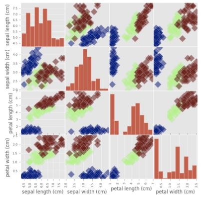
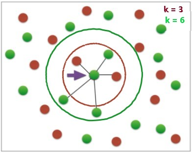
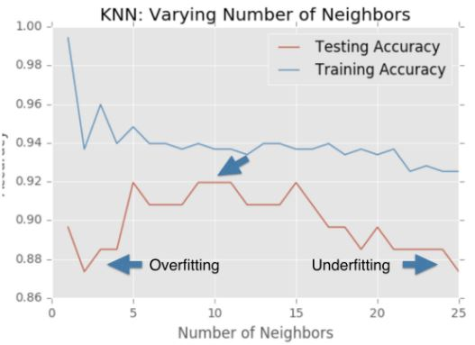

https://github.com/adam-p/markdown-here/wiki/Markdown-Cheatsheet
# __Supervised Learning with Scikit-learn__
<br>


## __Classification__
---

### __General Notes__
- Features = predictive variables = indepentent variables
- Target variable = response variable = dependent variable
- Train/test split
    - test_size (defaults to 25%)
    - random_state - sets the random seed to reproduce results
    - stratify - achieves same distribution or proportion of various targets in train/test sets as the original dataset
```
from sklearn.model_selection import train_test_split
X_train, X_test, y_train, y_test = 
    train_test_split(X, y, test_size=0.3,
        random_state=21, stratify=y)
```

- Helpful graph for __Exploratory Data Anaylsis (EDA)__
```
_ = pd.plotting.scatter_matrix(df, c=y, figsize=[8,8], s=150, marker='D')
```



### __K-Nearest Neighbors (KNN)__
- Grab the __k__ closest neighbors and predicting the target value based on those targe values



- Example code snippet
```
from sklearn.neighbors import KNeighborsClassifier
knn = KNeighborsClassifier(n_neighbors = 6)
knn.fit(iris['data'],iris['target'])
```
- Overfitting - Underfitting


<br>
___
<br>

## __Regression__

- Cross-validation
    - The metric of interest (Ex: R**2) is dependent on the split of the data. To combat this dependency, use cross-validation.


```
from sklearn.model_selection import cross_val_score
from sklean.linear_model import LinearRegression

reg = LinearRegression()
cv_results = cross_val_score(reg, X, y, cv=5)
```

### Regularization
- Ridge (aka L2 regularization)
    - Loss function = OLS loss function + __α Σa**2__
    - alpha (__α__) is a hyperparameter
        - __α = 0__: Get back OLS (Can lead to overfitting)
        - __Very large α__: Can lead to underfitting
```
from sklearn.linear_model import Ridge

X_train, X_test, y_train, y_test = train_test_split(X, y, random_state=42, test_size=0.3)
ridge = Ridge(alpha=0.1, normalized=True)
ridge.fit(X_train,y_train)
ridge_pred = ridge.predict(X_test)
ridge.score(X_test, y_test)
```

- Lasso (aka L1 regularization)
    - Loss function = OLS loss function + __α Σ|a|__
    - Can be used to select __important__ features of a dataset
    - Shrinks the coefficients of less important features to exactly 0
    - Code snippet same as Ridge (just replace Ridge with Lasso)
    - Lasso is great for feature selection, but when building regression models, Ridge regression should be your first choice.


