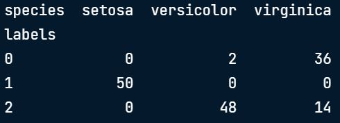
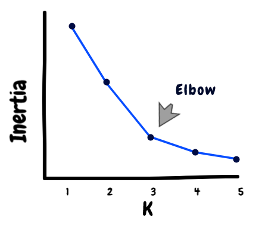
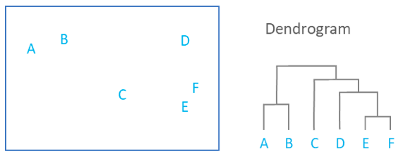

# __Unsupervised Learning with Scikit-learn__
<br>


## __K_means clustering__
#### __Overview__
- Predictions are made without having to reconstruct the clusters
    - It remembers the mean of the cluster (aka - "centroids")
    - Assigned to the closest centroid
```
from sklearn.cluster import KMeans
model = KMeans(n_clusters=3)
model.fit(samples)
```

#### __Evaluating a clustering__
- If data has *labels*, could use __cross tabulation__
```
df = pd.Dataframe({'labels': labels, 'species': species})
ct = pd.crosstab(df.labels,df.species)
print(ct)
```


- If data has *no labels*: __Inertia__
    - Measure the spread of the clusters from the centroid (*lower* is better)
        - A good clustering has tight clusters
    - **inertia_** is an attribute of the model after fit()



#### __Improve clustering__
- Normalize the features: scale all of the ranges to be mean = 0 and standard deviation = 1


## __Visualizing hierarchies__
- __Dendrogram__
    - Read from the bottom up
        - Initially there are as many clusters as there are data points
    - Vertical lines represent clusters
    - Height of the vertical lines = the distance between merging clusters

```
from scipy.cluster.hierarchy import linkage, fcluster
mergings = linkage(samples, method='complete')
labels = fcluster(mergings, 15, criterion='distance')
print(labels)
```
- 
    - Possible options for __method__:
        - *single*: distance between the 2 closest points in each cluster
        - *complete*: distance between the 2 farthest points in each cluster
        - *average*: average of all the distances
        - *weighted*: 
        - *centroid*: distance between the 2 centroids of each cluster
        - *median*: distance between the 2 medians of each cluster
    - **15** in fcluster represents the height at which to limit clusterings


<br>
___
<br>

## __t-SNE t-distributed Stochastic Neighbor Embedding__
- Technique for dimension reduction
- Only has a *fit_transform*
    - Can't extend the map to include new data samples
        - Must to start over each time!
```
import matplotlib.pyplot as plt
from sklearn.manifold import TSNE

model = TSNE(learning_rate=100)
transformed = model.fit_transform(samples)
xs = transformed[:,0]
ys = transformed[:,1]
plt.scatter(xs,ys,c=species)
plt.show()
``` 